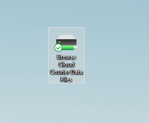
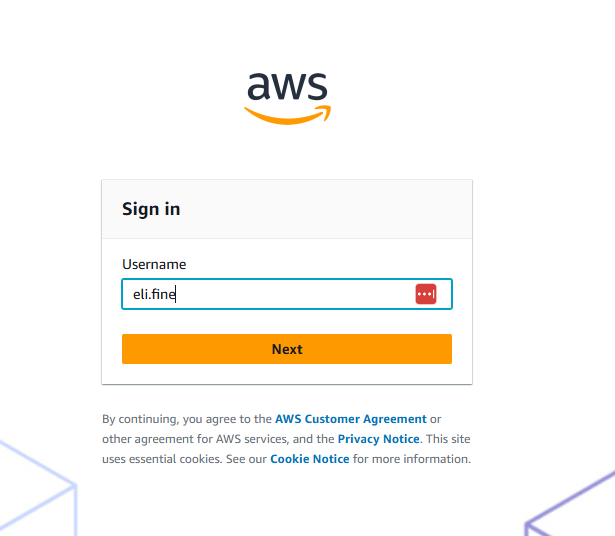
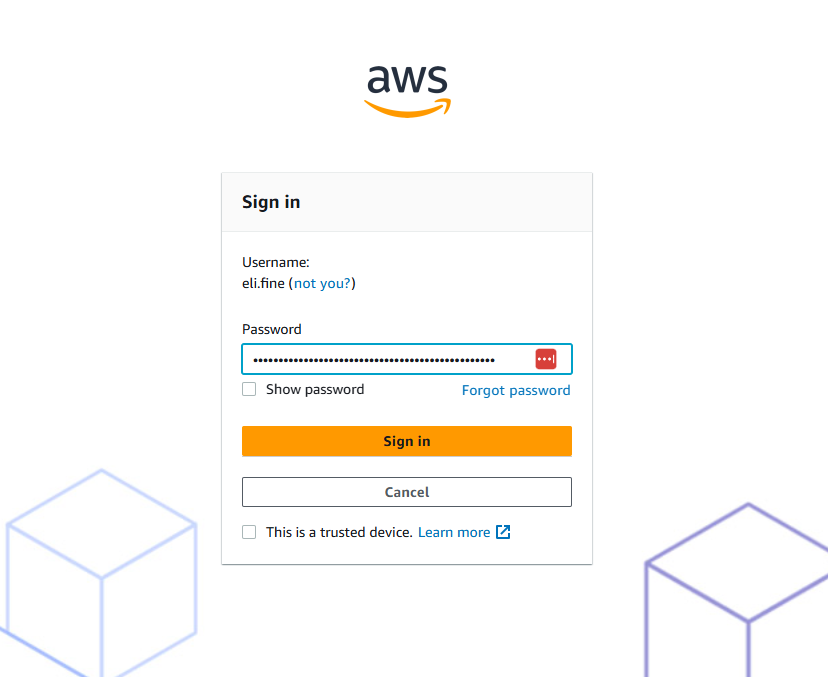
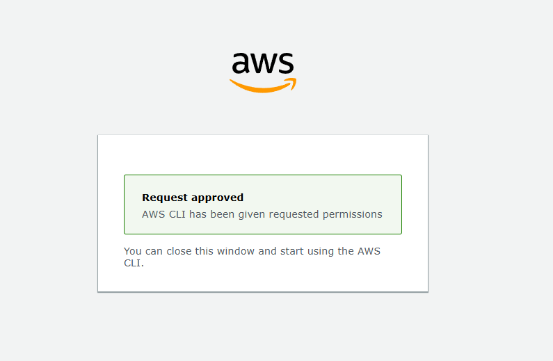
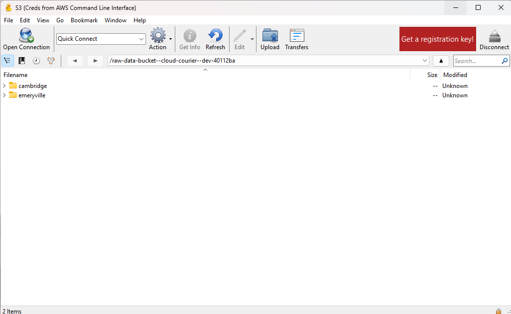

Accessing the Data files from your laptop
=========================================
.. _end-user-gui-access:

As a scientist, you want easy access to the data files generated by your experiments. The Cloud Courier infrastructure provides a simple way to access these files from your laptop.

It doesn't require any VPN or rely on a stable internet connection to the lab. Instead, it uses your company's existing Single Sign-On (SSO) authentication combined with AWS generating temporary credentials on your behalf. But you don't have to worry about any of that. All you do is click a desktop shortcut.

1. Click on the desktop shortcut.

2. If you haven't authenticated with your SSO provider recently, it will automatically open an internet browser window to the sign-in page (if you have recently authenticated, it will skip directly to step 4). This example uses AWS Identity Center for the SSO  (which is the default sign-on provider that Cloud Courier will configure if your company does not already have an SSO provider), but your SSO provider may be Okta, Google, Microsoft, etc.

3. After entering your username, you'll be prompted for your password. This example shows the AWS Identity Center login page, but your SSO provider may look different (it may even take your username and password on the same page).

4. After successfully authenticating through SSO, your browser will automatically redirect to this page letting you know that AWS has successfully granted your laptop the temporary credentials to access the data files uploaded by Cloud Courier.

5. In parallel, the Cyberduck desktop application will automatically launch and connect you to your lab's data files. You'll see a window like this:

